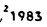

מגישים: אוהד גבאי ושני סמסון

## הקדמה
קיימים ברשותנו מסמכי חקיקה היסטוריים רבים בפורמטים סרוקים שעברו OCR.
לצערנו, סריקת OCR אינה מושלמת וקיימים מקרים בהם מתבצעות שגיאות בהמרה באמצעות OCR. כלומר, תוצרי ה-OCR שמתקבלים אינם נאמנים למקור, ומצויים בהם טעויות שונות. נציין לדוגמא מספר טעויות שנחשפנו אליהן במהלך המשימה.

1. שגיאות כתיב
a. החלפה בין כ' ל - ב': כולה -> בולה
b. החלפה בין ס' ל - 0: הסבר -> בולה
c. אותיות במקום מספרים:   -> ג98ו2, 1 -> ו
d. החלפה בין נ' ל - 'ב: המדינה -> המדיבה
2. שגיאות ברישום הערות שוליים:   -> התשכ"ג-1963 1 או התשכ"ג-11963 
3. בלבול בין "(מרכאות) לבין זוג גרשיים (' ')

